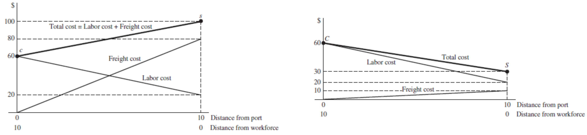
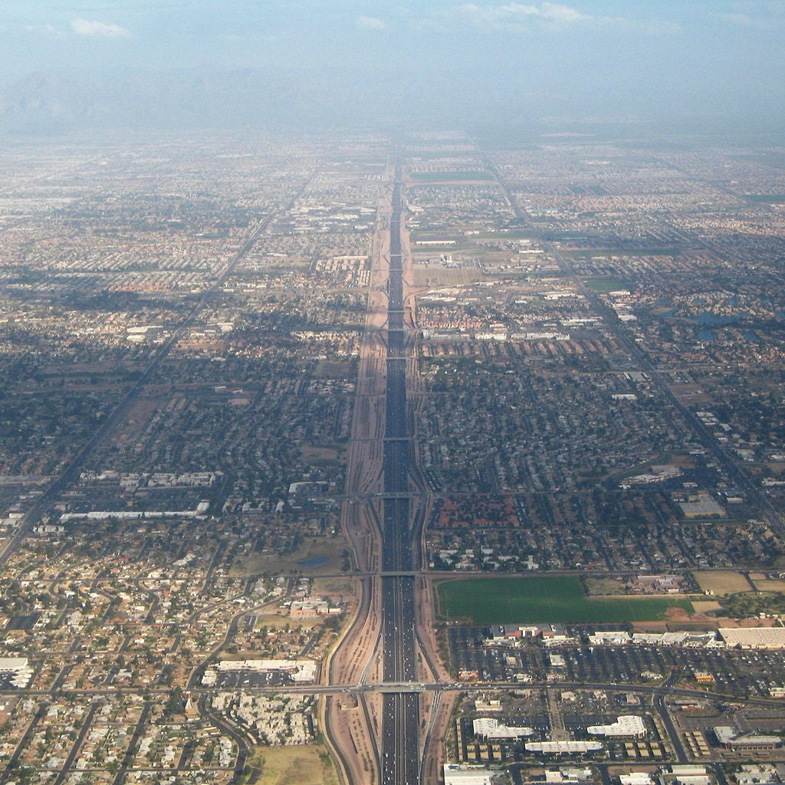
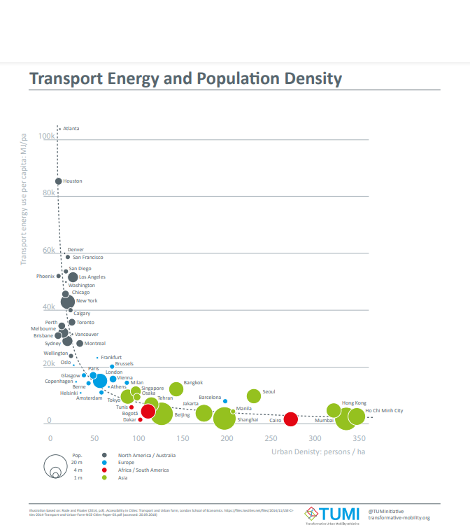
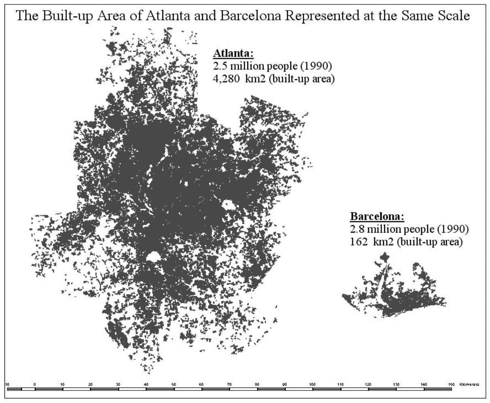
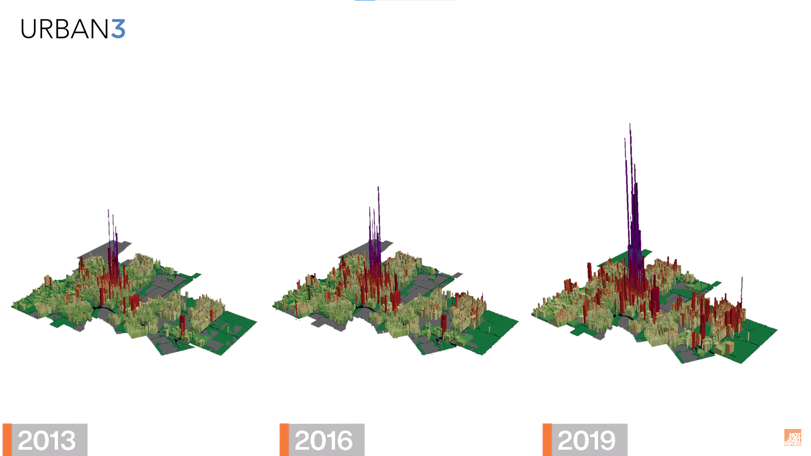

```{r setup, include=FALSE, echo=FALSE}
options(
  htmltools.dir.version  = FALSE,
  htmltools.preserve.raw = FALSE # needed for windows
)

knitr::opts_chunk$set(
  cache = TRUE,
  echo = FALSE,
  error = FALSE,
  include = TRUE,
  warning = FALSE,
  message = FALSE,
  dev = "svg",
  fig.retina = TRUE,
  fig.width = 10,
  fig.height = 5,
  fig.align = "center"
)

library(dplyr)
library(readr)
library(ggplot2)
library(icons)
library(here)

library(sf)

library(tmap)
library(DT)

#icons::download_fontawesome()

tmap_mode("view")
tmap_options(check.and.fix = TRUE,
             basemaps = c("Esri.WorldImagery", "OpenStreetMap", "Esri.WorldGrayCanvas"))

# xaringanExtra::use_logo(
#   image_url = here("src/ufjf.png")
# )
```


# Introdução

## Recapitulando

.pull-left[
### Dilema do indivíduo
* Acessibilidade: $min$ custos de transporte
* Espaço: $max$ área da residência
]

.pull-right[
### Dilema da firma
* Fatores: $min$ custo com salários, transporte e terra
* Aproveitar das economias de **aglomeração**
  + *Clusters* e subcentros
]


---

# Fatos estilizados

.pull-left[
### Firmas
* Comércio e serviços
  + Contato físico essencial $\rightarrow$ concentração no **CBD**
  + Contato é dispensável $\rightarrow$ onde for mais barato
* Indústrias
  + Aglomerar é bom...
  + ... mas fundamental estar perto dos nós de transporte
  + Subcentros especializados: polos automotivos, moveleiros etc.
]

.pull-right[
### Indivíduos
* Muito mais dispersos do que os empregos
* No entanto, o padrão de densidade prevalece!
* Gradiente de **densidade** e de **preços** a partir do CBD

### Padrões de deslocamento
* Empregos dispersos: deslocamentos dispersos
* Empregos concentrados: forte movimento pendular
]


----

> Fatos estilizados são "observações empíricas usadas como **ponto inicial** para a construção de teorias econômicas. Um fato estilizado **deve** ser verdadeiro no geral, mas não necessariamente em todos os casos" (*Oxford Reference*).


---

# Fatos estilizados

```{r bertaud_dens, out.width="45%", dev.args = list(bg = "transparent")}

```
.center[*Fonte: Bertaud (2018)*]


---

# Fatos estilizados

.pull-left[
```{r dens_sao, dev.args = list(bg = "transparent")}

```
]

.pull-right[
```{r dens_bhz, dev.args = list(bg = "transparent")}

```
]

.center[
[*Fonte: Jardim (2018)*](https://caosplanejado.com/novo-plano-diretor-de-belo-horizonte-mais-um-passo-para-o-fracasso/)
]


----

> O que causa os **desvios** dos fatos estilizados? Há um novo padrão, essas cidades são exceções ou não podemos generalizar o equilíbrio espacial intraurbano?


---

# Equilíbrio intraurbano ao longo do tempo

.pull-left[
## Paris, 1578

*Fonte: https://www.smith.edu/insight/stories/paris.php*
]

.pull-right[
## Île-de-France, hoje
```{r shp_paris, include=FALSE}
shp_paris <- sf::st_read(
  here("data/shp/paris.SHP")
) %>% 
  filter(NOM_REG == "ILE-DE-FRANCE")
```


```{r paris_map}
tm_shape(shp_paris) +
tm_borders(col = "orange")
```

]


---

# Primórdios

.pull-left[
### Tração animal
* Dentro da cidade
* Transbordo ao porto
* Deslocamento ao interior (caro e lento!)
]

.pull-right[
### Portos
* Deslocamento ao interior: cidades fluviais e costeiras
* Exportações
]


---- 

* O custo de transportar **mercadoria** era uma barreira muito grande, mesmo dentro da cidade
* Os trabalhadores se deslocavam a pé ou por tração animal
  + Cidade horizontalmente limitada
  + Deveriam morar perto das fábricas
* Resultado: fábricas no **centro** das cidades e zonas portuárias

> *Why the east end of most cities are poorer?* Vídeo do canal Wendover Productions: <br> https://www.youtube.com/watch?v=my9fsBix630&ab_channel=HalfasInteresting


---

# A ascensão da cidade monocêntrica

.pull-left[
### Ferrovia
* Revolução sem precedntes
* Mais mercados alcançados
* Aprofunda economias de algomeração
* Novo padrão: indústrias *clusterizadas* ao longo dos trilhos

```{r meat_old, out.width="90%", dev.args = list(bg = "transparent")}

```
]

.pull-right[
<br><br><br>
```{r meat_new, out.width="90%", dev.args = list(bg = "transparent")}

```
]


---

# A ascensão da cidade monocêntrica

### Inovações no transporte urbano

* Limite de uma aglomeração urbana: **uma hora** de deslocamento até o centro
* Novos modos de transporte permitem **aumentar** o tamanho das cidades e **aprofundar** as econominas de aglomeração
  + $\downarrow$ custos de transporte $\rightarrow$ $\uparrow$ área viável da cidade $\rightarrow$ especialização, troca de conhecimento, inovações
  
.pull-left[
#### Bonde em Juiz de Fora
```{r bonde_jf, out.width="80%", dev.args = list(bg = "transparent")}

```
Fonte: [Maria do Resguardo (2010)](https://www.mariadoresguardo.com.br/2010/01/o-bonde-arquivo-ramon-brandao.html)
]

.pull-right[
#### O *Underground* de Londres
```{r underground, out.width="80%", dev.args = list(bg = "transparent")}

```
Fonte: [History Today (2013)](https://www.historytoday.com/archive/months-past/first-day-london-tube)
]


---

# A ascensão da cidade monocêntrica

## Inovações na tecnologia de construção

.pull-left[
### Até início do séc. XIX
* Madeira era a base
* Caro e difícil subir mais que **três** andares
* Piso térreo era o mais valorizado: comodidade

### Pós revolução industrial
* Pregos barateados
* Estruturas em aço
* Elevador (1854): morar alto tem valor (vistas, ar)
]

.pull-right[
#### O primeiro arranhacéu: Chicago, EUA (1885)
```{r skyscraper, out.height="80%", dev.args = list(bg = "transparent")}

```
]


---

# A ascensão da cidade monocêntrica
## Ferrovia + bonde + elevador = novo equilíbrio espacial

.pull-left[
* Cidades crescem para cima e para os lados
* Favorece padrão **monocêntrico**
  + Comércio e serviços centralizados
  + Moradias ao longo da rede de transporte *(hub-and-spoke)*
* Indústrias ainda têm custo alto de transportar mercadoria, mas ficou barato levar os operários até elas: 
  + Permitiu ocupação ao longo dos trilhos
]


---

# A ascensão da cidade monocêntrica
## Ferrovia + bonde + elevador = novo equilíbrio espacial

.pull-left[
#### Centro de Belo Horizonte, ca. 1940-50
```{r centro_bh, dev.args = list(bg = "transparent")}

```
]

.pull-right[
#### Rede de bondes, anos 1960
```{r bonde_bh, out.width="60%", dev.args = list(bg = "transparent")}

```
]


---

# O declínio da cidade monocêntrica

## Caminhões
* Reduziram custo de transporte
* Eliminaram necessidade de estar perto da ferrovia ou do cliente
* Ficou competitivo em relação ao trem e ao navio

### Decisão locacional: antes *vs.* depois do caminhão
```{r caminhao, dev.args = list(bg = "transparent")}

```
Fonte: O'Sullivan (2011)


---

# O declínio da cidade monocêntrica

.pull-left[
## Carros
* Carro: nova revolução no transporte de pessoas
  + Deslocamentos fora dos eixos de trilhos
  + Mais opções locacionais
]
  
.pull-right[
## Rodovias e o rodoviariarismo
* Pós-guerra: rodovias e viadutos
* Prioridade ao transporte individual
* Zoneamento 
]

```{r phoenix, out.width="40%", dev.args = list(bg = "transparent")}

```


---

# O declínio da cidade monocêntrica

## Setor terciário

* Até anos 1970: contato era indispensável
  + Não tinha excel, não tinha email!
  + É caro transportar relatórios: atividades operacionais **devem** estar no centro
* Anos 1980 em diante: informática
  + Várias atividades eliminadas ou feitas virtualmente
  + Exemplo: *call centers* na Índia


----

Se o presencial é indispensável, a tendência é centralizar. Por isso os centros não morreram completamente!

> *"Para várias profissões, até para trabalhos altamente intelectuais, o trabalho presencial aumenta a **produtividade**. Interações **não planejadas** nos corredores e em espaços comuns costumam ser chave para o progresso. Tão importante quanto isso, o trabalho remoto é raramente tão agradável quanto estar na mesma sala"* <br> Glaeser e Cutler (2021).


---

# O declínio da cidade monocêntrica

## Outros fatores

* Organização industrial
  + Plantas horizontais requerem espaço
  + Terra mais barata no subúrbio
  + Custo de transporte não é mais uma restrição tão forte
* Aeroportos
  + Produtos de alto valor agregado
  + Novos *clusters* próximos aos aeroportos
  + Aerotrópole: Amsterdam, Panamá, Belo Horizonte (projeto)


---

# Causas do espraiamento

### Terra é bem normal

$\partial x / \partial m > 0$

$$
\begin{cases}
\text{Aumento da renda} \rightarrow \text{demanda por lotes maiores} \\
\text{Carros} \rightarrow \downarrow \text{custo de deslocar } \rightarrow \text{fuga aos subúrbios}
\end{cases}
$$

### Deslocamento do emprego

Efeito retroalimentador: empresas se afastam do centro $\leftrightarrow$ trabalhadores se mudam


  

---

# Causas do espraiamento

## Estados Unidos

* Externalidades do automóvel **não** são internalizadas
  + Subsídios ao combustível
  + Investimento massivo em infraestrutura para o automóvel
  + Pouca ou nenhuma taxação da poluição
  + Ausência de pedágios urbanos/tarifas de congestionamento
* Financiamento de imóveis favorece residências unifamiliares
* Zonaeamento: *red lining*, briga de interesses
* Baixa prioridade para transporte coletivo
  + Pouco financiamento
  + Ciclo vicioso: baixa densidade o torna pouco eficiente
  
> *"A construção da I-95 em Miami exigiu a relocação forçada de mais de 12 mil residentes, sendo quase 100% deles negros. Usando desapropriações, o governo tomou construções no coração da comunidade negra de Miami em Overtown, oferecendo contrapartidas bem abaixo do valor de mercado para os proprietários e nada para os inquilinos"*. <br> Segregation by Design, vídeo: https://twitter.com/SegByDesign/status/1592179874139344896


---

# Causas do espraiamento

### Diferenças culturais

* EUA: preferência por casas em lotes grandes
  + Favorece espraiamento
* Leste asiático: preferência por centralidade
  + Favorece adensamento


---

# Causas do espraiamento

## NIMBY *vs.* YIMBY

.pull-left[
#### NIMBY: **Not** in my backyard

* Foco na externalidade negativa do adensamento
* Zoneamento unifamiliar
* Usos separados
]


.pull-right[
#### YIMBY: **Yes** in my backyard
* Foco na externalidade positiva do adensamento
* Uso misto
* Mais investimento público em transporte coletivo
]


---

# Consequências do espraiamento

```{r density, out.width="40%", dev.args = list(bg = "transparent")}

```
*Fonte: https://twitter.com/UrbanistOrg/status/1499051911495835650*


---

# Consequências do espraiamento

## Atlanta *vs.* Barcelona

```{r atlbcn, out.width="40%", dev.args = list(bg = "transparent")}

```
*Fonte: Bertaud (2004)*


---

# Consequências do espraiamento
```{r njb, out.width="40%", dev.args = list(bg = "transparent")}

```
[Suburbia is Subsidized: here is the math](https://www.youtube.com/watch?v=7Nw6qyyrTeI&ab_channel=NotJustBikes)


---

# Para além do livro texto

## Livros
* Jacobs (2011). Morte e vida nas grandes cidades
* Bertaud (2018). Order without design: How markets shape cities
* Glaeser e Cutler (2021). The survival of the city

## Mídias
* Podcast Caos Planejado
  + Alguns episódios: #29 Economia Urbana, #37 Acessibilidade à moradia, #69 A evolução do penamento urbano no Brasil 
* Youtube
  + São Paulo Nas Alturas, City Beautiful, Wendover Productions, Not Just Bikes
* Twitter
  + Perfis sobre urbanismo: @UrbanDemog, @caosplanejado, @rauljustelores, @ChittiMarco, @mnolangray, @SegByDesign e outros 


---

# Dúvidas?

.pull-left[.pull-down[

### Arthur Bazolli Alvarenga

<a href="mailto:arthur.bazolli@estudante.ufjf.br">
`r icons::fontawesome("paper-plane")` arthur.bazolli@estudante.ufjf.br
</a>

<a href="https://baarthur.github.io/urbana_grad/">
`r icons::fontawesome("link")` baarthur.github.io/urbana_grad/
</a>

<a href="http://twitter.com/baarthur0">
`r icons::fontawesome("twitter")` @baarthur0
</a>

<a href="http://github.com/baarthur">
`r icons::fontawesome("github")` @baarthur
</a>

<br><br><br>

]]


.pull-right[.pull-down[

### Rosa Lívia Gonçalves Montenegro

<a href="mailto:rosa.livia@ufjf.br">
`r icons::fontawesome("paper-plane")` rosa.livia@ufjf.br
</a>

<br><br><br>

]]

